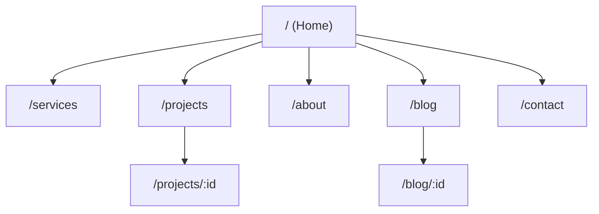

# 📋 Tài Liệu Bàn Giao UI/UX — Pepper Builders & Makers

> **Website**: [https://pepper.builders](https://pepper.builders)
> **Framework**: Next.js (App Router) + TailwindCSS v4 + Motion (Framer Motion)
> **Ngày cập nhật**: 2026-06-15

---

## 1. Design System

### 1.1 Phong cách thiết kế

Phong cách tổng thể: **Minimal Editorial** — lấy cảm hứng từ tạp chí kiến trúc cao cấp.

| Đặc điểm | Mô tả |
|-----------|-------|
| Tone | Monochrome (đen-trắng-xám), tối giản, chuyên nghiệp |
| Corners | **Không bo góc** (`rounded-none`) — tất cả button, card, input đều vuông cạnh |
| Spacing | Rộng rãi, nhiều whitespace, `py-24` đến `py-32` giữa các section |
| Image style | Grayscale mặc định → chuyển màu khi hover (trên trang Home) |
| Layout | Container centered `max-width: 1280px`, padding `px-6 md:px-12` |

### 1.2 Bảng màu (Color Palette)

```
┌─────────────────────────────────────────────────┐
│  BRAND COLORS                                   │
├─────────────────┬───────────────────────────────┤
│  Primary Black  │  #111111 / #030213            │
│  Pure White     │  #FFFFFF                      │
│  Light Gray BG  │  #F7F7F7                      │
│  Border         │  #E0E0E0                      │
├─────────────────┴───────────────────────────────┤
│  TEXT COLORS                                    │
├─────────────────┬───────────────────────────────┤
│  Heading        │  #111111 (black)              │
│  Body           │  #555555 (neutral-600)        │
│  Muted/Label    │  #999999 (neutral-400/500)    │
│  Placeholder    │  neutral-400                  │
├─────────────────┴───────────────────────────────┤
│  FOOTER                                        │
├─────────────────┬───────────────────────────────┤
│  Background     │  #0f1115 (gần đen)            │
│  Text chính     │  white                        │
│  Text phụ       │  neutral-400                  │
│  Label heading  │  neutral-500                  │
│  Border         │  neutral-800/80               │
└─────────────────┴───────────────────────────────┘
```

> [!IMPORTANT]
> Website **KHÔNG sử dụng màu sắc rực rỡ**. Toàn bộ palette xoay quanh trắng-đen-xám. Ảnh sử dụng `grayscale` filter để duy trì tone chung.

### 1.3 Typography

| Element | Font Family | Weight | Size | Ghi chú |
|---------|------------|--------|------|---------|
| **Heading (h1-h4)** | `Playfair Display` (serif) | 500 (medium) | Responsive | Dùng cho tiêu đề lớn, số liệu thống kê |
| **Body text** | `Inter` (sans-serif) | 300-400 (light/normal) | 16px base | Nội dung chính, mô tả |
| **Label/Button** | `Inter` | 500-700 (medium/bold) | 12-14px | `uppercase`, `tracking-widest` |
| **Navigation** | `Inter` | 400-600 | 14px | `tracking-wide` |

**Quy tắc chung:**
- Heading luôn dùng **serif** (`font-serif`)
- Body luôn dùng **sans-serif** (`font-sans`)
- Button/Label luôn **UPPERCASE** + `tracking-widest` (letter-spacing rộng)
- Line-height: `leading-relaxed` cho body, `leading-tight` cho heading

**Import Google Fonts:**
```css
@import url('https://fonts.googleapis.com/css2?family=Playfair+Display:ital,wght@0,400;0,500;0,600;0,700;1,400;1,500;1,600;1,700&family=Inter:wght@300;400;500;600;700&display=swap');
```

### 1.4 Button Styles

| Variant | CSS Classes | Sử dụng |
|---------|-----------|---------|
| **Primary (solid)** | `bg-[#111111] text-white px-8 py-4 font-bold text-sm uppercase tracking-widest hover:bg-neutral-800` | CTA chính: "Nhận tư vấn", "Liên hệ ngay" |
| **Secondary (outline)** | `bg-white border border-[#E0E0E0] text-[#111111] px-8 py-4 font-bold text-sm uppercase tracking-widest hover:bg-[#F7F7F7]` | CTA phụ: "Xem các công trình" |
| **Text link** | `inline-flex items-center gap-2 text-sm font-bold hover:underline underline-offset-4` | "Xem thêm →", "Xem chi tiết →" |
| **Underline link** | `border-b border-black pb-1 group-hover:border-neutral-500` | Trong Services, Blog |

> [!NOTE]
> Tất cả button đều **vuông cạnh** (`rounded-none`), không bo góc.

### 1.5 Icon System

Sử dụng thư viện **Lucide React** (`lucide-react`):

| Icon | Sử dụng |
|------|---------|
| `ArrowRight`, `ArrowLeft` | Navigation, CTA, breadcrumb |
| `ArrowUp` | Scroll to top button |
| `Building2`, `Home`, `Briefcase` | Service category icons |
| `MapPin`, `Phone`, `Mail`, `Clock` | Contact info |
| `Menu`, `X` | Mobile hamburger menu |
| `Hexagon`, `Triangle`, `Circle`, `Square` | Core values icons (About page) |
| `ChevronDown` | FAQ accordion |
| `MoveHorizontal` | Before/After slider handle |
| `Facebook`, `Instagram`, `Linkedin` | Social media (Footer) |

---

## 2. Cấu Trúc Trang & Routing



| Route | Component | Mô tả |
|-------|-----------|-------|
| `/` | `Home.tsx` | Trang chủ, landing page |
| `/about` | `About.tsx` | Giới thiệu công ty, giá trị, quy trình |
| `/services` | `Services.tsx` | Chi tiết dịch vụ, FAQ |
| `/projects` | `Projects.tsx` | Grid gallery tất cả dự án |
| `/projects/[id]` | `ProjectDetail.tsx` | Chi tiết từng dự án |
| `/blog` | `Blog.tsx` | Danh sách bài viết |
| `/blog/[id]` | `BlogDetail.tsx` | Chi tiết bài viết |
| `/contact` | `Contact.tsx` | Form liên hệ, Google Maps |

---

## 3. Shared Components

### 3.1 Header ([Header.tsx](file:///d:/WORK/WEBSITE/PEPPER/PepperBuildersMakers/src/components/Header.tsx))

| Thuộc tính | Mô tả |
|-----------|-------|
| **Vị trí** | `fixed top-0`, `z-50` |
| **Trạng thái Home (chưa scroll)** | Transparent background, text + logo trắng |
| **Trạng thái Home (đã scroll)** | `bg-white/95 backdrop-blur-md`, border bottom, text đen |
| **Trạng thái các trang khác** | `bg-white`, text đen |
| **Logo** | Import từ `@/app/logo.svg`, kích thước `h-10 md:h-14` |
| **Nav links** | Services, Projects, About, Blog, Contact |
| **Language switcher** | `VI / EN` — toggle giữa 2 ngôn ngữ |
| **CTA button** | "Nhận Tư Vấn" → navigate tới `/contact` |
| **Mobile** | Hamburger menu → fullscreen overlay `bg-black/80 backdrop-blur-xl` |

### 3.2 Footer ([Footer.tsx](file:///d:/WORK/WEBSITE/PEPPER/PepperBuildersMakers/src/components/Footer.tsx))

| Thuộc tính | Mô tả |
|-----------|-------|
| **Background** | `#0f1115` (dark) |
| **Layout** | 4 columns: Brand (4col), Contact (3col), Navigation (2col), Services (2col) |
| **Logo** | Invert trắng (`brightness-0 invert`) |
| **Tagline** | `"You Dream It, We Build It."` — font serif |
| **Social icons** | Facebook, Instagram, LinkedIn — border icon `w-10 h-10` |
| **Bottom bar** | Copyright + "Thiết kế & Thi công trọn gói" |

### 3.3 ScrollToTop ([ScrollToTop.tsx](file:///d:/WORK/WEBSITE/PEPPER/PepperBuildersMakers/src/components/ScrollToTop.tsx))

- Hiện khi scroll > 300px
- `fixed bottom-8 right-8`, `bg-black text-white`
- Animation: fade in/out + slide up/down (Framer Motion)

### 3.4 ImageWithFallback ([ImageWithFallback.tsx](file:///d:/WORK/WEBSITE/PEPPER/PepperBuildersMakers/src/components/figma/ImageWithFallback.tsx))

- Wrapper cho `` tag
- Xử lý fallback khi ảnh lỗi
- Dùng thay thế cho Next.js `<Image>` component

---

## 4. Chi Tiết Từng Trang

### 4.1 Trang Home (`/`)

[Home.tsx](file:///d:/WORK/WEBSITE/PEPPER/PepperBuildersMakers/src/components/pages/Home.tsx) — 7 sections

````carousel
#### Section 1: Hero Banner
- **Layout**: Full-screen (`h-screen`), centered content
- **Background**: 5 ảnh auto-slideshow (mỗi 5s), grayscale, opacity 0.6
- **Animation**: Crossfade giữa các ảnh (`AnimatePresence`)
- **Content**: 
  - H1: `"Thiết kế & Thi công toàn diện"` (serif, 5xl/7xl)
  - Tagline: `"You Dream It, We Build It"` (light, italic)
  - CTA: `"Nhận tư vấn miễn phí"` → `/contact`
<!-- slide -->
#### Section 2: Dịch vụ nổi bật
- **Layout**: 3 columns grid, border cards
- **Cards**: Border `#E0E0E0`, overlap `-ml-[1px] -mt-[1px]`
- **Icon**: Lucide (Building2, Home, Briefcase) — `stroke-1`
- **Content per card**: Icon → Title (uppercase, tracking) → Description → "Xem thêm →"
- 3 dịch vụ: HOSPITALITY, RESIDENTIAL, COMMERCIAL
<!-- slide -->
#### Section 3: Quy trình rút gọn
- **Layout**: Center aligned, horizontal flow
- 3 steps: numbered boxes `w-6 h-6 border` → text
- Steps separated by `ArrowRight` icon (opacity 30%)
- Link: "Xem quy trình đầy đủ →" → `/about`
<!-- slide -->
#### Section 4: Dự án tiêu biểu (Horizontal Slider)
- **Layout**: Horizontal scroll, draggable
- **Header**: Title + Filter tabs (ALL/HOSPITALITY/RESIDENTIAL/COMMERCIAL) + Arrow controls
- **Cards**: Width `clamp(300px, 40vw, 560px)`, aspect `4/3`
- **Image**: Grayscale → color on hover, scale 105% on hover
- **Badge**: Category label, `bg-black/70 backdrop-blur-sm`
- **Progress bar**: `h-[2px]`, animated width based on scroll position
- **CTA**: "Xem tất cả dự án" button
<!-- slide -->
#### Section 5: Số liệu thống kê
- **Background**: `#F7F7F7`, border top/bottom
- **Layout**: 4 columns grid, centered
- **Data**: `15+` (Năm KN), `0` (Phát sinh CP), `98%` (KH hài lòng), `100%` (Đúng tiến độ)
- **Style**: Số lớn serif `5xl/7xl`, label `uppercase tracking-widest` nhỏ
<!-- slide -->
#### Section 6: Tại sao chọn Pepper
- **Layout**: 2 columns — title (5col) + grid 2x2 (7col)
- **Title**: Serif, `4xl/6xl`
- **Cards**: 4 items numbered `01-04` (Thiết kế, Thi công, Quản lý, Vận hành)
- **Style**: Number nhỏ muted → Title bold → Description muted
<!-- slide -->
#### Section 7: CTA Section
- **Background**: `#F7F7F7`, border top
- **Layout**: 2 columns — Title (left) + 2 Buttons (right)
- **Buttons**: Primary "Liên hệ ngay" + Secondary outline "Xem các công trình"
````

---

### 4.2 Trang About (`/about`)

[About.tsx](file:///d:/WORK/WEBSITE/PEPPER/PepperBuildersMakers/src/components/pages/About.tsx) — 5 sections

| Section | Layout | Nội dung |
|---------|--------|---------|
| **Hero Title** | Typography-driven, staggered animation | 4 dòng xen kẽ xám/đen: "Kiến tạo / không gian. / Định hình / phong cách." — font rất lớn `7rem`, uppercase, tracking tighter |
| **Hero Image** | Full-width, `60vh/80vh` | Ảnh kiến trúc, scale-in animation |
| **Intro & Philosophy** | 2 columns: Quote (left) + Paragraphs (right) | Quote dạng serif `3xl/5xl` light + 2 đoạn body text giới thiệu công ty |
| **Stats Divider** | 4 columns, `bg-neutral-50` | 4 số liệu: 15+, 0, 100%, 100% — staggered fade-in |
| **Core Values** | Section title muted + 2x2 grid | 4 giá trị: Tinh Tế, Sáng Tạo, Bền Vững, Tận Tâm — mỗi item có icon Lucide + border-top |
| **Process** | **Sticky layout**: title sticky left + 6 steps scroll right, `bg-black text-white` | 6 bước quy trình: 01→06, số lớn `font-mono` chuyển trắng khi hover |
| **Big CTA** | Center aligned, large text + button | "Cùng kiến tạo không gian tiếp theo" + "Khởi tạo dự án" button (with hover scale) |

---

### 4.3 Trang Services (`/services`)

[Services.tsx](file:///d:/WORK/WEBSITE/PEPPER/PepperBuildersMakers/src/components/pages/Services.tsx) — 4 sections

| Section | Layout | Nội dung |
|---------|--------|---------|
| **Editorial Hero** | 12-col grid: 8col title + 4col description | H1 lớn `4xl-7xl` + divider line `w-12 h-[2px]` + description |
| **Services List** | 3 blocks, alternating image/text layout | Mỗi service: Number (`/01`) + Category tag + Title UPPERCASE rất lớn + Long description + "Xem dự án →". Image `aspect-[4/5]` → hover zoom |
| **Process** | Identical layout to About page | Sticky title + 6 scrollable steps, `bg-black` |
| **FAQ** | Split layout: 4col intro + 8col accordion | Radix Accordion, chevron rotation animation, slide in/out |

---

### 4.4 Trang Projects (`/projects`)

[Projects.tsx](file:///d:/WORK/WEBSITE/PEPPER/PepperBuildersMakers/src/components/pages/Projects.tsx)

| Thuộc tính | Mô tả |
|-----------|-------|
| **Title** | "Công trình đã thực hiện" — bold, uppercase |
| **Filter Tabs** | ALL / HOSPITALITY / RESIDENTIAL / COMMERCIAL — animated underline (`layoutId="activeTab"`) |
| **Grid** | 2 columns, `gap-12` |
| **Card** | Image `aspect-4/3` → hover zoom 105% + Title bold uppercase + Location + Category label |
| **Animation** | `AnimatePresence` — scale in/out khi filter thay đổi |

---

### 4.5 Trang Project Detail (`/projects/[id]`)

[ProjectDetail.tsx](file:///d:/WORK/WEBSITE/PEPPER/PepperBuildersMakers/src/components/pages/ProjectDetail.tsx)

| Section | Mô tả |
|---------|-------|
| **Breadcrumb** | Home / Projects / Project Name |
| **Title** | H1 rất lớn `4xl-7xl`, uppercase |
| **Hero Image** | Full-width, `50vh/75vh` |
| **Info Table** | 5-column: Client, Scale, Services, Location, Year — border rows |
| **Description** | Large body text `xl/2xl`, font-light |
| **Before/After Slider** | Interactive drag slider, `clipPath` technique, grayscale before vs color after |
| **Gallery** | Masonry grid pattern: Full → Half+Half → Full → ... |
| **CTA** | "Bạn có dự án tương tự?" + "Bắt đầu dự án" button |
| **Prev/Next Navigation** | Split-screen fullbleed: 2 panels with background images, hover animations |

---

### 4.6 Trang Blog (`/blog`)

[Blog.tsx](file:///d:/WORK/WEBSITE/PEPPER/PepperBuildersMakers/src/components/pages/Blog.tsx)

| Section | Mô tả |
|---------|-------|
| **Title** | "Blog & Góc nhìn" + subtitle description |
| **Featured Post** | 2-column layout: Image left (`40vh/60vh`) + Content right — hover bg change |
| **Grid Posts** | 3 columns, card: Image `4/3` + Category + Title + Excerpt |
| **Hover effects** | Image zoom 105%, title color change |

---

### 4.7 Trang Blog Detail (`/blog/[id]`)

[BlogDetail.tsx](file:///d:/WORK/WEBSITE/PEPPER/PepperBuildersMakers/src/components/pages/BlogDetail.tsx)

| Section | Mô tả |
|---------|-------|
| **Breadcrumb** | Home / Blog / Article Title |
| **Header** | Center aligned: Category + Date + Title `4xl-6xl` |
| **Hero Image** | Max-width 5xl, `50vh/70vh` |
| **Content** | Max-width `3xl`, prose-like styling. Support **bold** markdown |
| **Share bar** | Back link + Share buttons (Facebook, LinkedIn, X) |
| **Related Posts** | 2-column, image + text side-by-side, `bg-neutral-50` |

---

### 4.8 Trang Contact (`/contact`)

[Contact.tsx](file:///d:/WORK/WEBSITE/PEPPER/PepperBuildersMakers/src/components/pages/Contact.tsx)

| Section | Mô tả |
|---------|-------|
| **Layout** | 2 columns: Info (left) + Form (right) |
| **Info column** | H1 "Sẵn sàng cho dự án tiếp theo?" + Contact details (MapPin, Phone, Mail, Clock) + Google Maps iframe |
| **Form column** | Background `neutral-50`, padding `p-8 md:p-12` |
| **Form fields** | Name (text), Email + Phone (2col), Project Type (Radix Select dropdown), Budget (text), Description (textarea) |
| **Submit button** | Full-width, `bg-black text-white py-4` |
| **Success state** | Check icon + "Cảm ơn bạn!" message + "Gửi yêu cầu khác" link |
| **Google Maps** | Embedded iframe, Pepper House location |

---

## 5. Animations & Hiệu ứng

Sử dụng **Motion** (Framer Motion) — `motion/react`

### 5.1 Scroll-based Animations

| Animation | Variant | Sử dụng |
|-----------|---------|---------|
| **Fade Up** | `{ y: 24 } → { y: 0 }` | Hầu hết các section khi scroll vào viewport |
| **Fade Up (with opacity)** | `{ opacity: 0, y: 40 } → { opacity: 1, y: 0 }` | Services page sections |
| **Stagger Children** | `staggerChildren: 0.1` | Heading lines trong About, FAQ items |
| **Scale In** | `{ opacity: 0, scale: 0.95 } → { opacity: 1, scale: 1 }` | Project cards filter, About hero image |
| **Slide from Right** | `{ opacity: 0, x: 20 } → { opacity: 1, x: 0 }` | Process steps |

### 5.2 Interaction Animations

| Hiệu ứng | CSS/Motion | Sử dụng |
|-----------|-----------|---------|
| **Image Zoom** | `hover:scale-105 transition-transform duration-700` | Tất cả card images |
| **Grayscale to Color** | `grayscale group-hover:grayscale-0 duration-700` | Home project slider |
| **Hero Crossfade** | `AnimatePresence mode="popLayout"` + opacity/scale | Home hero slideshow (5s interval) |
| **Button hover** | `hover:bg-neutral-800 transition-colors` | Primary buttons |
| **Arrow hover** | `group-hover:translate-x-1 transition-transform` | Text links with ArrowRight |
| **Tab underline** | `motion.div layoutId="activeTab"` | Projects filter tabs |
| **Mobile menu** | Slide down + fade overlay | Header mobile menu |
| **ScrollToTop** | `fade + slideY` via `AnimatePresence` | Bottom-right button |
| **FAQ Accordion** | `slide-in-from-top + fade` animation | Services FAQ section |

### 5.3 Custom Interactions

| Component | Behavior |
|-----------|----------|
| **Before/After Slider** | Mouse/Touch drag → `clipPath` update, CSS custom cursor `cursor-ew-resize` |
| **Horizontal Project Slider** | Drag to scroll, snap mandatory, progress bar updates on scroll |
| **Header scroll** | `window.scrollY > 20` → toggle transparent/solid |

---

## 6. Đa Ngôn Ngữ (i18n)

### Cách hoạt động

- **Context**: `LanguageProvider` wrapping toàn app ([LanguageContext.tsx](file:///d:/WORK/WEBSITE/PEPPER/PepperBuildersMakers/src/contexts/LanguageContext.tsx))
- **State**: `language: 'VI' | 'EN'`
- **Switcher**: Trong Header, hiển thị `VI / EN`
- **Pattern**: Mỗi page component định nghĩa object `t` chứa tất cả string theo ngôn ngữ:

```tsx
const t = {
  title: language === 'VI' ? "Tiêu đề" : "Title",
  desc: language === 'VI' ? "Mô tả..." : "Description...",
};
```

- **Data files**: `projects.ts`, `blog.ts` chứa content bilingual với struct `{ vi: string, en: string }`

---

## 7. Data Sources

### 7.1 Projects ([projects.ts](file:///d:/WORK/WEBSITE/PEPPER/PepperBuildersMakers/src/data/projects.ts))

Mỗi project object:
```ts
{
  id: string,
  name: string,
  category: "Hospitality" | "Residential" | "Commercial",
  client: string,
  location: { vi: string, en: string },
  scale: string,
  year: string,
  services: { vi: string, en: string },
  description: { vi: string, en: string },
  img: string,          // Hero image URL
  beforeImg?: string,   // Before image cho slider
  gallery?: string[],   // Array of gallery image URLs
}
```

### 7.2 Blog Posts ([blog.ts](file:///d:/WORK/WEBSITE/PEPPER/PepperBuildersMakers/src/data/blog.ts))

```ts
{
  id: string,
  title: { vi: string, en: string },
  excerpt: { vi: string, en: string },
  content: { vi: string, en: string },
  date: { vi: string, en: string },
  category: string,
  img: string,
}
```

---

## 8. SEO & Metadata

### 8.1 Root Layout Metadata

- **Title template**: `%s | Pepper Builders & Makers`
- **Default title**: `Pepper Builders & Makers — Thiết kế & Thi công trọn gói tại TP.HCM`
- **OpenGraph**: type `website`, locale `vi_VN`, alt `en_US`
- **Twitter**: `summary_large_image`

### 8.2 Structured Data (JSON-LD)

File: [structured-data.tsx](file:///d:/WORK/WEBSITE/PEPPER/PepperBuildersMakers/src/lib/structured-data.tsx)

| Schema | Sử dụng |
|--------|---------|
| `WebSite` | Root layout |
| `Organization` | Root layout |
| `LocalBusiness` | About, Contact |
| `FAQPage` | Services page |
| `Article` | Blog detail pages |
| `BreadcrumbList` | Project detail, Blog detail |

### 8.3 Other SEO files

- [robots.ts](file:///d:/WORK/WEBSITE/PEPPER/PepperBuildersMakers/src/app/robots.ts)
- [sitemap.ts](file:///d:/WORK/WEBSITE/PEPPER/PepperBuildersMakers/src/app/sitemap.ts)
- [not-found.tsx](file:///d:/WORK/WEBSITE/PEPPER/PepperBuildersMakers/src/app/not-found.tsx) — Custom 404 page

---

## 9. Assets & Branding

| Asset | Đường dẫn | Ghi chú |
|-------|-----------|---------|
| **Favicon** | [favicon.ico](file:///d:/WORK/WEBSITE/PEPPER/PepperBuildersMakers/src/app/favicon.ico) | Auto-detected bởi Next.js App Router |
| **Logo SVG** | [logo.svg](file:///d:/WORK/WEBSITE/PEPPER/PepperBuildersMakers/src/app/logo.svg) | 2000×1000px (đã crop landscape), chứa embedded bitmap |
| **Images** | Unsplash URLs | Tạm dùng stock images, cần thay bằng ảnh thật khi deploy |

> [!WARNING]
> Tất cả ảnh hiện tại đang dùng **Unsplash URLs**. Cần thay thế bằng ảnh thực của dự án trước khi go-live.

---

## 10. Key Dependencies

| Package | Mục đích |
|---------|---------|
| `next` | Framework chính (App Router) |
| `tailwindcss` v4 | Styling (utility-first CSS) |
| `motion` (Framer Motion) | Animation & transitions |
| `lucide-react` | Icon system |
| `@radix-ui/react-select` | Select dropdown (Contact form) |
| `@radix-ui/react-accordion` | FAQ accordion (Services page) |
| `tw-animate-css` | Tailwind animation utilities |

---

## 11. Responsive Breakpoints

Theo TailwindCSS mặc định:

| Breakpoint | Min-width | Sử dụng |
|-----------|-----------|---------|
| `sm` | 640px | Nhỏ: CTA buttons inline |
| `md` | 768px | Tablet: 2-col layouts, larger typography |
| `lg` | 1024px | Desktop: Full multi-column layouts |

**Pattern chung:**
- Mobile: Single column, smaller text, hamburger menu
- Tablet (`md`): 2 columns, medium text
- Desktop (`lg`): Full layout, large typography, sticky elements
